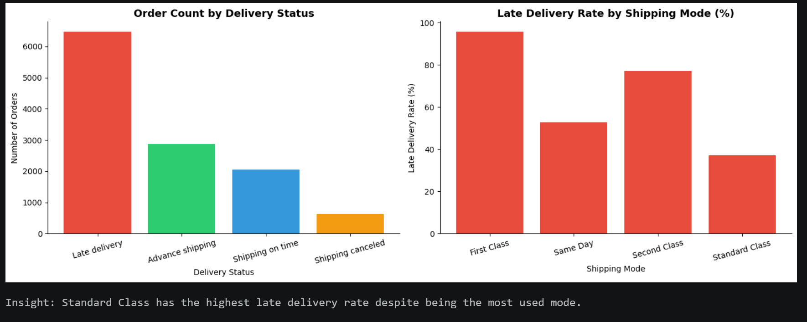
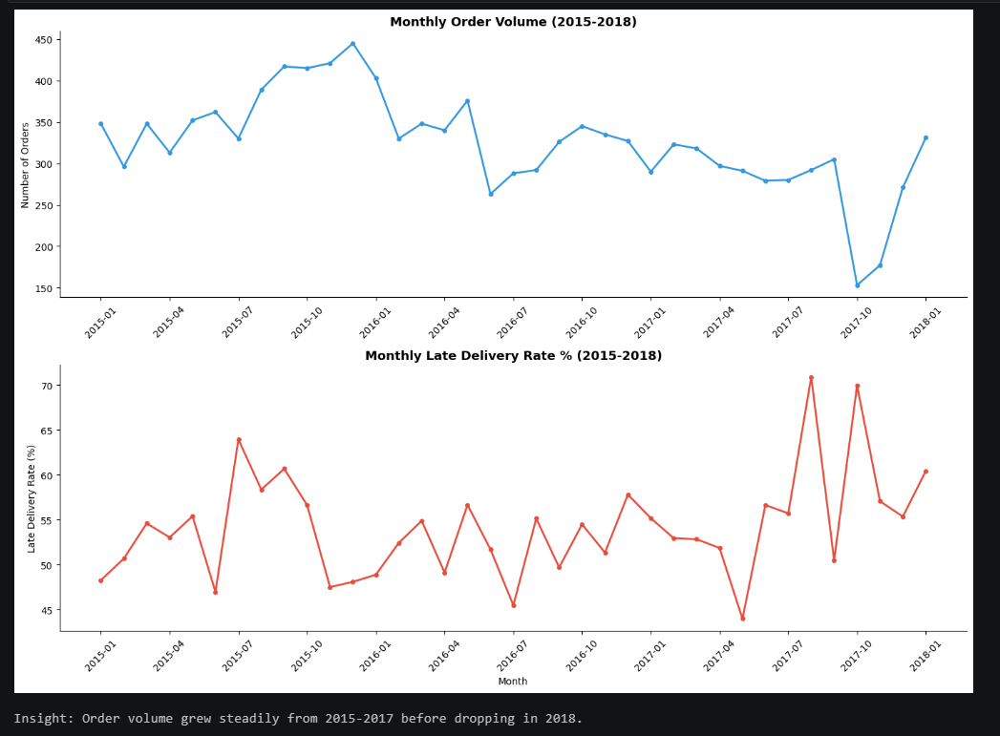
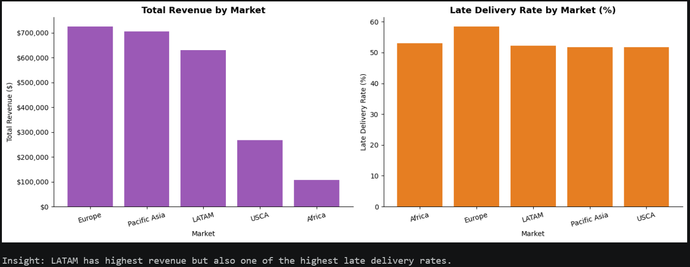
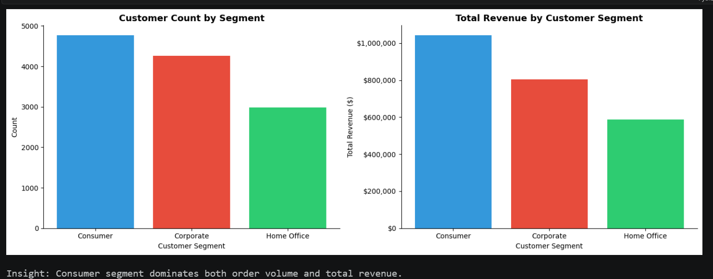
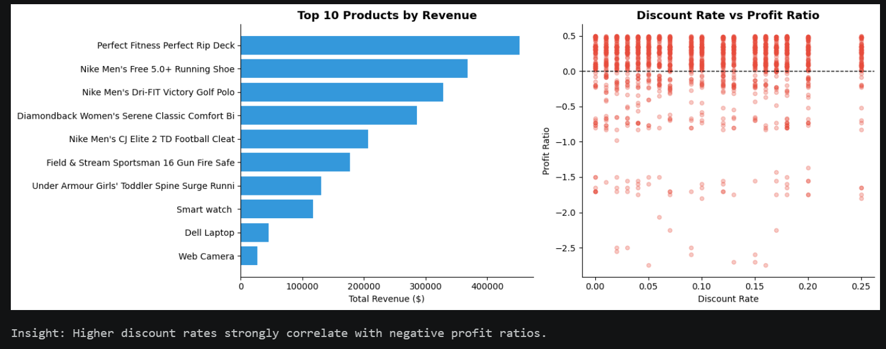

# 🚚 SupplyPulse: Supply Chain Performance Analytics


An end-to-end data analytics project analyzing supply chain performance across **180,519 orders** spanning global markets. The project covers delivery performance, customer behavior, product profitability, and regional trends using **MySQL** for analysis and **Python/pandas** for data processing.

---

## 📌 Business Problem

Supply chain inefficiencies — late deliveries, unprofitable products, underperforming markets — directly impact revenue and customer satisfaction. This project answers critical business questions that operations and logistics teams face daily:

- Which shipping modes and regions have the highest late delivery rates?
- Which customer segments drive the most revenue?
- Which products are loss-making and why?
- How does revenue trend month-over-month across global markets?

---

## 📂 Project Structure

```
Supply_Chain_Analytics/
│
├── data/
│   ├── raw/                          # Original dataset (not pushed to GitHub)
│   └── processed/                    # Normalized tables (6 CSV files)
│       ├── customers.csv
│       ├── categories.csv
│       ├── departments.csv
│       ├── products.csv
│       ├── orders.csv
│       └── order_items.csv
│
├── sql/
│   ├── 01_schema_setup.sql           # Database schema, PKs, FKs
│   ├── 02_delivery_analysis.sql      # Late delivery patterns & SLA analysis
│   ├── 03_customer_analysis.sql      # Customer segmentation & revenue
│   ├── 04_product_profitability.sql  # Product & category profit analysis
│   ├── 05_regional_market_analysis.sql # Market & regional performance
│   └── 06_advanced_analytics.sql    # Window functions, CTEs, trends
│
├── notebooks/
│   └── eda_supply_chain.ipynb        # Exploratory Data Analysis (Python)
│
├── scripts/
│   └── normalize_supply_chain.py     # Data normalization script
│
└── README.md
```

---

## 🗄️ Database Schema

The raw flat file (63 columns) was normalized into **6 relational tables**:

```
customers ──────────────────────────────────────────┐
    customer_id (PK)                                 │
    customer_segment, customer_city, ...             │
                                                     ▼
categories ──── products ──── order_items ──── orders
    category_id      product_card_id (PK)   order_item_id (PK)   order_id (PK)
    category_name    product_name           order_id (FK)         customer_id (FK)
                     category_id (FK)       product_card_id (FK)  shipping_mode
                     department_id (FK)     sales, profit...      delivery_status
                         │                                         late_delivery_risk
departments ─────────────┘
    department_id (PK)
    department_name
```

---

## 🔍 SQL Analysis Files

### 02 — Delivery Analysis
- Late vs on-time delivery count and percentage
- Late delivery rate by shipping mode and market
- Monthly late delivery trends (2015–2018)
- Worst performing shipping mode by on-time rate

### 03 — Customer Analysis
- Customer count per segment
- Top 10 customers by order volume
- Revenue and average order value per segment
- Customer ranking by total spending using `RANK()` window function

### 04 — Product Profitability
- Products per department and average price per category
- Top 10 products by revenue and profit
- Loss-making products using `HAVING SUM(profit) < 0`
- Impact of discount rate on profit ratio using `CASE` bins

### 05 — Regional Market Analysis
- Revenue and order volume per market
- Late delivery rate (%) per market and region
- Top 5 revenue-generating countries
- Average shipping delay gap by region

### 06 — Advanced Analytics (Window Functions)
- Month-over-month order count change using `LAG()`
- Customer ranking within segment using `RANK() PARTITION BY`
- Running total of sales using `SUM() OVER()`
- Top 3 products per department using `ROW_NUMBER()` + chained CTEs
- 3-month moving average of revenue using `ROWS BETWEEN 2 PRECEDING AND CURRENT ROW`
- Cumulative late delivery count per shipping mode over time
- Customers above average order frequency using CTE + subquery

---

## 📈 Key Findings

### 1. Delivery Performance

- 59% of orders carry late delivery risk
- Standard Class has highest late delivery rate despite being most used

### 2. Sales Trend Over Time  

- Order volume grew steadily 2015–2017 before declining in 2018

### 3. Regional Market Performance

- LATAM generates highest revenue but also has high late delivery rates

### 4. Customer Segments

- Consumer segment dominates both order count and revenue

### 5. Product Profitability

- Higher discount rates strongly correlate with negative profit ratios

## 🛠️ Tech Stack

| Tool | Purpose |
|------|---------|
| MySQL 8.0 | Database, all SQL analysis |
| MySQL Workbench | Query execution and testing |
| Python 3 | Data normalization and EDA |
| pandas / numpy | Data cleaning and transformation |
| VS Code | SQL file management and Git |
| GitHub | Version control and portfolio showcase |

---

## 📊 Dataset

**Source:** [DataCo Smart Supply Chain Dataset](https://www.kaggle.com/datasets/shashwatwork/dataco-smart-supply-chain-for-big-data-analysis) — Kaggle

| Attribute | Detail |
|-----------|--------|
| Raw rows | 180,519 |
| Raw columns | 63 |
| Tables after normalization | 6 |
| Date range | 2015 – 2018 |
| Markets covered | Europe, LATAM, Pacific Asia, USCA, Africa |
| Product categories | 51 |
| Departments | 11 |

> Raw CSV files are not pushed to GitHub due to size (95MB+). Download from the Kaggle link above and run `scripts/normalize_supply_chain.py` to generate processed tables.

---

## ⚡ Key SQL Concepts Demonstrated

- `INNER JOIN` across 3 tables
- `GROUP BY` with `HAVING` for post-aggregation filtering
- Subqueries inside `WHERE` and `SELECT`
- Window functions: `RANK()`, `ROW_NUMBER()`, `LAG()`, `SUM() OVER()`, `AVG() OVER()`
- `PARTITION BY` for segment-wise ranking
- `ROWS BETWEEN` frame clause for moving averages
- Chained CTEs for multi-step analysis
- `CASE` statements for custom binning
- `STR_TO_DATE()` for datetime parsing

---

## 🚀 How to Run

1. Clone this repository
```bash
git clone https://github.com/ShriyaSandeepTorgale/Supply_Chain_Analytics.git
```

2. Download the dataset from Kaggle and place in `data/raw/`

3. Run the normalization script
```bash
python scripts/normalize_supply_chain.py
```

4. Open MySQL Workbench, create database and run schema
```sql
CREATE DATABASE supply_chain_db;
USE supply_chain_db;
-- Run sql/01_schema_setup.sql
```

5. Import the 6 processed CSVs into their respective tables

6. Run analysis files in order (02 → 06)

---

## 👩‍💻 Author

**Shriya Torgale**
GitHub: [@ShriyaSandeepTorgale](https://github.com/ShriyaSandeepTorgale)

---

*This project was built as part of a data analytics portfolio targeting data analyst roles.*
